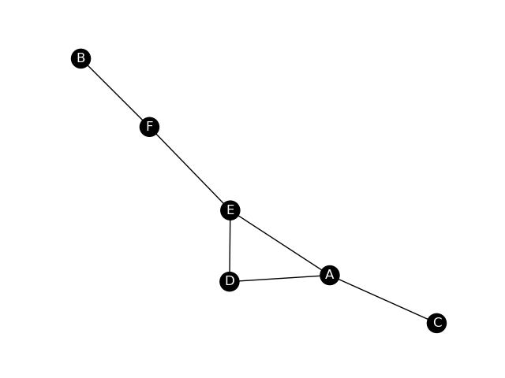
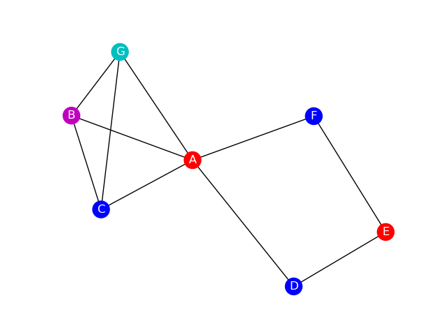
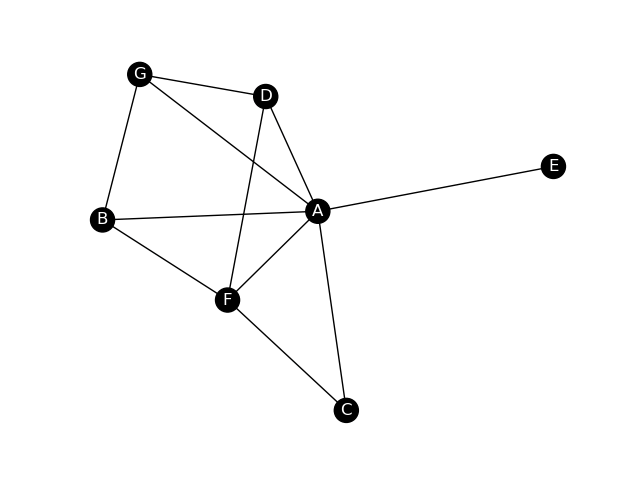
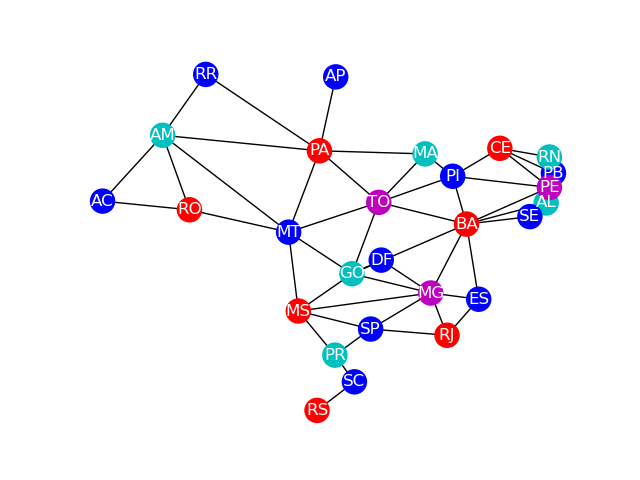
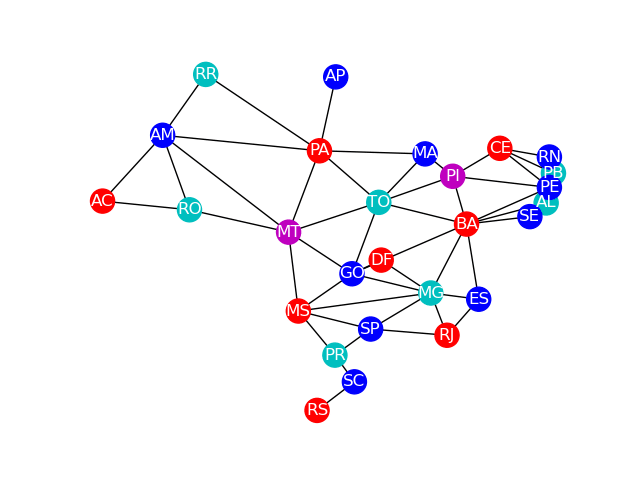

# Resolução


- [Resolução](#resolução)
  - [Sobre o algoritmo:](#sobre-o-algoritmo)
  - [Problema do canil <a name = "cachorros"></a>](#problema-do-canil-)
    - [Mínimo de casinhas: 3](#mínimo-de-casinhas-3)
  - [Problema dos containers <a name = "containers"></a>](#problema-dos-containers-)
    - [Mínimo de containers: 4](#mínimo-de-containers-4)
  - [Problema dos aquários <a name = "peixes"></a>](#problema-dos-aquários-)
    - [Mínimo de aquários: 3](#mínimo-de-aquários-3)
    - [Máximo de aquários: 4](#máximo-de-aquários-4)
  - [Coloração do mapa do Brasil <a name = "brasil"></a>](#coloração-do-mapa-do-brasil-)
    - [Mínimo de cores: 4](#mínimo-de-cores-4)
    - [Máximo de cores: 5](#máximo-de-cores-5)

## Sobre o algoritmo:
```
// todo
```
## Problema do canil <a name = "cachorros"></a>

### Mínimo de casinhas: 3
|                   Por etapas                       |               Final                |              Outras combinações   |
| :---------------------------------------------:    | :--------------------------------: |:--------------------------------: |
|     |  | |

## Problema dos containers <a name = "containers"></a>

### Mínimo de containers: 4
|                    Por etapas                       |                Final                 |                Outras combinações    |
| :-----------------------------------------------:   | :----------------------------------: | :----------------------------------: |
|    |  |  |

## Problema dos aquários <a name = "peixes"></a>

### Mínimo de aquários: 3
|                     Por etapas                      |                 Final                  |                 Outras combinações     |
| :-------------------------------------------------: | :------------------------------------: | :------------------------------------: |
|  |  |  |

### Máximo de aquários: 4
|                     Por etapas                      |                 Final                  |
| :-------------------------------------------------: | :------------------------------------: |
|  |  |

## Coloração do mapa do Brasil <a name = "brasil"></a>

### Mínimo de cores: 4
|                      Por etapas                      |                  Final                  |                  Outras combinações     |
| :--------------------------------------------------: | :-------------------------------------: | :-------------------------------------: |
|   |   |   |

### Máximo de cores: 5
|                      Por etapas                      |                  Final                  |
| :--------------------------------------------------: | :-------------------------------------: |
|   |   |


